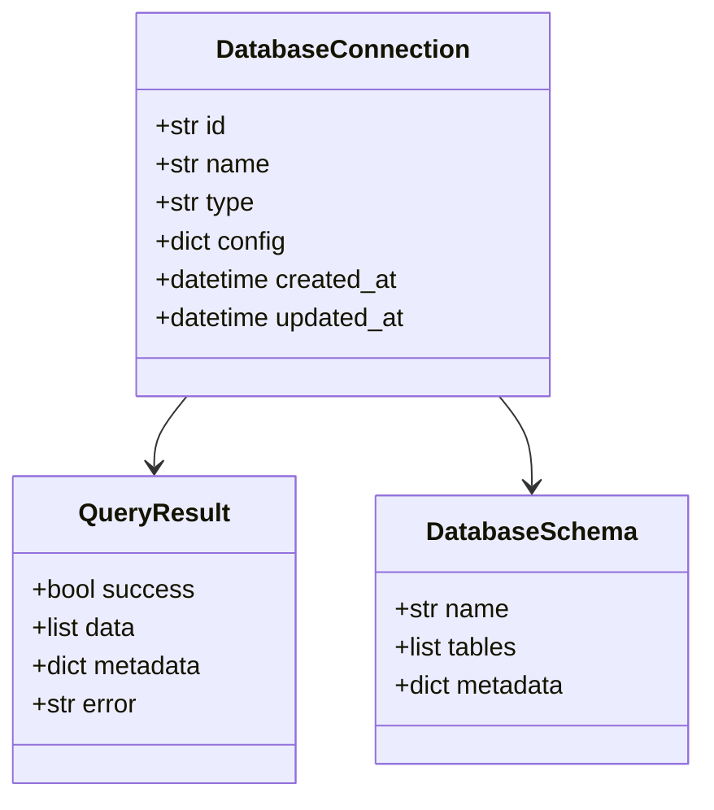

# Database Operations MCP - Product Requirements Document (PRD)

## 1. Overview

**Product Name**: Database Operations MCP  
**Version**: 1.0.0  
**Target Release**: Q4 2025  
**Status**: In Development  

## 2. Product Purpose

Database Operations MCP is a FastMCP 2.10.1 compliant server that provides a unified interface for managing and interacting with multiple database systems, including PostgreSQL, MongoDB, and ChromaDB. It enables secure, efficient, and consistent database operations across different database technologies.

## 3. Target Audience

- Data Engineers
- Database Administrators
- Backend Developers
- Data Scientists
- AI/ML Engineers

## 4. Features and Functionality

### 4.1 Core Features

1. **Multi-Database Support**
   - PostgreSQL
   - MongoDB
   - ChromaDB
   - SQLite

2. **Database Operations**
   - Connection management
   - Query execution
   - Schema inspection
   - Performance monitoring
   - Health checks

3. **Security**
   - Secure credential storage
   - Role-based access control
   - SQL injection prevention
   - TLS/SSL encryption

### 4.2 Technical Specifications

- **Framework**: FastMCP 2.10.1
- **Language**: Python 3.9+
- **Dependencies**:
  - pymongo
  - psycopg2
  - chromadb
  - pydantic
  - fastapi
  - uvicorn

## 5. User Stories

### 5.1 Database Administrator
- As a DBA, I want to monitor database health and performance metrics
- As a DBA, I want to execute ad-hoc queries across different database systems
- As a DBA, I want to manage database connections securely

### 5.2 Developer
- As a developer, I want to interact with different databases using a consistent API
- As a developer, I want to test queries before deploying to production
- As a developer, I want to get database schema information programmatically

## 6. Technical Architecture

### 6.1 System Components

1. **API Layer**
   - FastAPI-based RESTful API
   - WebSocket support for real-time operations
   - Authentication and authorization

2. **Service Layer**
   - Database connection management
   - Query execution
   - Schema inspection
   - Performance monitoring

3. **Data Access Layer**
   - Database connectors
   - Connection pooling
   - Transaction management

### 6.2 Data Model



## 7. API Endpoints

### 7.1 Connection Management
- `POST /connections` - Create a new database connection
- `GET /connections` - List all database connections
- `GET /connections/{id}` - Get connection details
- `PUT /connections/{id}` - Update connection
- `DELETE /connections/{id}` - Delete connection
- `POST /connections/{id}/test` - Test connection

### 7.2 Query Execution
- `POST /query` - Execute a query
- `GET /query/history` - Get query history
- `GET /query/explain` - Explain query execution plan

### 7.3 Schema Operations
- `GET /schemas` - List all schemas
- `GET /schemas/{schema}/tables` - List tables in schema
- `GET /schemas/{schema}/tables/{table}` - Get table schema

## 8. Security Requirements

1. **Authentication**
   - JWT-based authentication
   - API key support

2. **Authorization**
   - Role-based access control (RBAC)
   - Fine-grained permissions

3. **Data Protection**
   - Encryption at rest
   - Encryption in transit (TLS 1.2+)
   - Secure credential storage

## 9. Performance Requirements

- Response time < 500ms for 95% of queries
- Support for 100+ concurrent connections
- Memory usage < 1GB for 100 active connections
- Query timeout: 30 seconds (configurable)

## 10. Monitoring and Logging

- Structured logging (JSON format)
- Metrics collection (Prometheus)
- Health check endpoint
- Audit logging for sensitive operations

## 11. Deployment

### 11.1 Prerequisites

- Python 3.9+
- Docker (optional)
- Database servers (PostgreSQL, MongoDB, ChromaDB)

### 11.2 Installation

```bash
# Clone the repository
git clone https://github.com/sandraschi/database-operations-mcp.git
cd database-operations-mcp

# Install dependencies
pip install -e .

# Start the server
uvicorn database_operations.main:app --reload
```

### 11.3 Docker

```bash
docker build -t database-operations-mcp .
docker run -p 8000:8000 database-operations-mcp
```

## 12. Future Enhancements

1. **Additional Database Support**
   - MySQL
   - SQL Server
   - Oracle
   - Redis

2. **Advanced Features**
   - Query builder
   - Data import/export
   - Database migration tools
   - Scheduled queries

3. **UI/UX Improvements**
   - Web-based admin interface
   - Query visualization
   - Performance dashboards

## 13. Success Metrics

- Number of active connections
- Query success rate
- Average query execution time
- User adoption rate
- Number of supported database types

## 14. Appendix

### 14.1 Related Documents

- [API Documentation](docs/API.md)
- [Developer Guide](docs/DEVELOPER_GUIDE.md)
- [Security Policy](docs/SECURITY.md)

### 14.2 Glossary

- **MCP**: Model Control Protocol
- **JWT**: JSON Web Token
- **RBAC**: Role-Based Access Control
- **TLS**: Transport Layer Security
