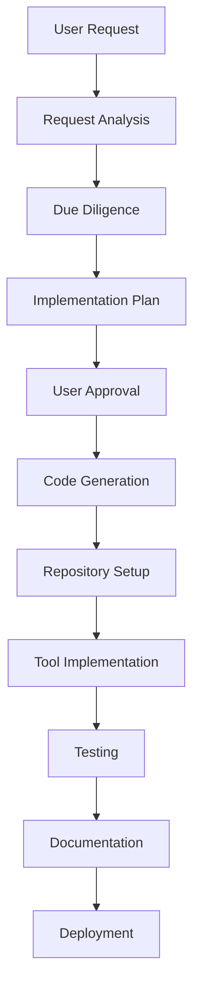

# MCP Server Builder: Automated DXT Server Creation

> **⚠️ OUTDATED**: This document describes DXT server creation which has been replaced by MCPB packaging. The current MCPB system is different from the DXT system described here.

## Overview

> **⚠️ OUTDATED**: The MCP Server Builder described here uses DXT packaging which has been replaced by MCPB packaging.

## How It Works



## Core Components

### 1. Request Analysis
- Parses natural language requests
- Identifies target application and requirements
- Determines project scope

### 2. AI-Powered Due Diligence

#### 2.1 Initial Assessment
- **Commercial Applications**
  1. Company website analysis
  2. API/CLI documentation review
  3. Developer resources identification
  4. Licensing and terms of service
  
- **Open Source Projects**
  1. GitHub/GitLab repository analysis
  2. Documentation review
  3. Issue tracker and community activity
  4. Build and dependency analysis

#### 2.2 Technical Deep Dive
- **API Analysis**
  - REST/GraphQL endpoints
  - Authentication mechanisms
  - Rate limiting and quotas
  - Webhook support
  
- **CLI Analysis**
  - Command structure
  - Subcommands and options
  - Output formats (JSON, XML, etc.)
  - Interactive vs non-interactive modes

#### 2.3 MCP Suitability Assessment
- **Tool Identification**
  - Core functionality mapping
  - Common use cases
  - Potential edge cases
  - Performance considerations

- **Implementation Complexity**
  - Authentication requirements
  - Data transformation needs
  - Error handling strategy
  - Testing requirements

### 3. Implementation Plan
- Lists required tools and endpoints
- Outlines project structure
- Identifies dependencies
- Estimates resource requirements

## Implementation Guide

### 1. Prerequisites
- Python 3.8+
- Git
- DXT CLI
- LLM API access

### 2. Project Structure
```
mcp-builder/
├── src/
│   ├── __init__.py
│   ├── main.py
│   ├── analyzer.py
│   ├── generator.py
│   └── templates/
│       ├── basic/
│       └── database/
├── tests/
└── README.md
```

### 3. Core Implementation

#### 3.1 Request Processing
```python
def analyze_request(request: str) -> dict:
    """Analyze user request and extract key information."""
    prompt = f"""
    Analyze this MCP server creation request:
    {request}
    
    Extract:
    1. Target application name
    2. Main functionality
    3. Expected tools/endpoints
    4. Special requirements
    
    Return as JSON.
    """
    response = llm_complete(prompt)
    return json.loads(response)
```

#### 3.2 Due Diligence
```python
async def perform_due_diligence(app_info: dict) -> dict:
    """
    Perform comprehensive due diligence on the target application.
    
    Args:
        app_info: Dictionary containing application details
        
    Returns:
        dict: Detailed due diligence report
    """
    # Initialize report
    report = {
        "application": app_info['name'],
        "type": None,  # commercial/oss
        "findings": [],
        "recommendations": [],
        "risks": [],
        "complexity": None
    }
    
    # Step 1: Determine application type and gather basic info
    app_type = await determine_application_type(app_info['name'])
    report['type'] = app_type
    
    # Step 2: Gather technical information
    if app_type == 'commercial':
        # Analyze commercial application
        website = await find_website(app_info['name'])
        docs = await find_documentation(website)
        
        if 'api' in app_info.get('requirements', []):
            api_info = await analyze_api(docs)
            report.update(api_info)
            
        if 'cli' in app_info.get('requirements', []):
            cli_info = await analyze_cli(docs)
            report.update(cli_info)
            
    elif app_type == 'oss':
        # Analyze open source project
        repo_url = await find_github_repo(app_info['name'])
        if repo_url:
            repo_info = await analyze_github_repo(repo_url)
            report.update(repo_info)
            
            # Check for existing MCP implementations
            existing_impl = await check_existing_mcp_implementations(app_info['name'])
            report['existing_implementations'] = existing_impl
    
    # Step 3: Analyze implementation requirements
    report['complexity'] = await estimate_implementation_complexity(report)
    
    # Step 4: Generate recommendations
    report['recommendations'] = await generate_recommendations(report)
    
    return report

async def analyze_github_repo(repo_url: str) -> dict:
    """Analyze GitHub repository for MCP implementation feasibility."""
    analysis = {
        'repo_metrics': {},
        'documentation_quality': None,
        'api_endpoints': [],
        'cli_commands': [],
        'dependencies': []
    }
    
    # Get repository metadata
    repo_data = await fetch_github_api(repo_url)
    analysis['repo_metrics'].update({
        'stars': repo_data.get('stargazers_count', 0),
        'forks': repo_data.get('forks_count', 0),
        'open_issues': repo_data.get('open_issues_count', 0),
        'last_updated': repo_data.get('pushed_at')
    })
    
    # Analyze documentation
    docs = await check_documentation(repo_url)
    analysis['documentation_quality'] = rate_documentation(docs)
    
    # Identify potential tools
    if 'api' in repo_data.get('topics', []):
        analysis['api_endpoints'] = await identify_api_endpoints(repo_url)
        
    if 'cli' in repo_data.get('topics', []) or 'command-line' in repo_data.get('topics', []):
        analysis['cli_commands'] = await identify_cli_commands(repo_url)
    
    # Check for Python package dependencies
    analysis['dependencies'] = await analyze_dependencies(repo_url)
    
    return analysis
```

#### 3.3 Implementation Plan Generation
```python
def generate_implementation_plan(app_info: dict, diligence: dict) -> dict:
    """Generate detailed implementation plan."""
    prompt = f"""
    Create an implementation plan for an MCP server for {app_info['name']}.
    
    Application details: {app_info}
    Due diligence: {diligence}
    
    Include:
    1. List of tools to implement
    2. Project structure
    3. Dependencies
    4. Implementation steps
    
    Return as JSON.
    """
    return llm_complete(prompt, response_format="json")
```

## Tool Generation

### 1. Tool Identification
```python
def identify_tools(app_name: str) -> List[dict]:
    """Identify relevant tools for the application."""
    prompt = f"""
    For a {app_name} application, list the most useful MCP tools to implement.
    
    For each tool, provide:
    - Name (snake_case)
    - Description
    - Parameters
    - Example usage
    
    Return as JSON array.
    """
    return llm_complete(prompt, response_format="json")
```

### 2. Tool Implementation
```python
def generate_tool_implementation(tool_spec: dict) -> str:
    """Generate Python code for a tool."""
    prompt = f"""
    Write a FastMCP tool implementation for:
    {json.dumps(tool_spec, indent=2)}
    
    Include:
    - Type hints
    - Docstring with parameters and return value
    - Error handling
    - Logging
    """
    return llm_complete(prompt)
```

## Repository Setup

### 1. Project Initialization
```python
def initialize_project(project_name: str, plan: dict):
    """Set up new project repository."""
    # Create directory structure
    os.makedirs(f"{project_name}/src/{project_name}", exist_ok=True)
    
    # Initialize git repository
    subprocess.run(["git", "init", project_name])
    
    # Create basic files
    create_file(f"{project_name}/pyproject.toml", generate_pyproject(project_name, plan))
    create_file(f"{project_name}/README.md", generate_readme(project_name, plan))
    create_file(f"{project_name}/.gitignore", generate_gitignore())
```

## User Interaction

### 1. Plan Presentation
```python
def present_plan(plan: dict):
    """Present implementation plan to user."""
    print("\n" + "="*50)
    print("IMPLEMENTATION PLAN")
    print("="*50)
    print(f"Project: {plan['project_name']}")
    print(f"Description: {plan['description']}")
    print("\nTools to implement:")
    for tool in plan['tools']:
        print(f"- {tool['name']}: {tool['description']}")
    
    print("\nDependencies:")
    for dep in plan['dependencies']:
        print(f"- {dep}")
    
    print("\nEstimated effort: {plan['effort']} hours")
    return input("\nProceed with implementation? (y/n): ").lower() == 'y'
```

## Example Workflow

1. **User Request**
   ```
   make a dxt server for ImageMagick with tools for basic image manipulation
   ```

2. **AI Analysis**
   - **Step 1: Application Identification**
     - Identifies ImageMagick as open-source image manipulation tool
     - Locates official GitHub repository and documentation
     
   - **Step 2: Technical Assessment**
     - Discovers comprehensive CLI interface
     - Identifies core commands: convert, resize, crop, etc.
     - Notes potential complexity in handling various image formats
     
   - **Step 3: Existing Solutions**
     - Checks for existing MCP implementations
     - Reviews similar projects for reference
     - Analyzes potential integration points
     
   - **Step 4: Requirements Mapping**
     - Maps requested features to ImageMagick capabilities
     - Identifies additional useful tools not explicitly requested
     - Flags any potential limitations or special considerations

3. **Plan Generation**
   - **Proposed Tools**
     - `convert_image`: Convert between image formats
     - `resize_image`: Resize with various algorithms
     - `crop_image`: Crop with precise coordinates
     - `apply_filter`: Apply built-in filters
     - `get_image_info`: Extract metadata
     
   - **Technical Stack**
     - Python wrapper for ImageMagick (Wand/Pillow)
     - Asynchronous processing for large images
     - Input/output validation
     
   - **Dependencies**
     - Core: `wand` (ImageMagick binding)
     - Testing: `pytest`, `pytest-asyncio`
     - Documentation: Sphinx + autoapi
     
   - **Effort Estimation**
     - Implementation: 8-12 hours
     - Testing: 4-6 hours
     - Documentation: 2-3 hours

4. **User Approval**
   - Presents plan
   - Gets confirmation
   - Proceeds with implementation

5. **Implementation**
   - Creates project structure
   - Implements tools
   - Sets up testing
   - Generates documentation

## Best Practices

1. **Tool Design**
   - Keep tools focused and atomic
   - Follow RESTful principles
   - Implement proper error handling

2. **Code Quality**
   - Use type hints
   - Write comprehensive docstrings
   - Follow PEP 8 guidelines

3. **Documentation**
   - Generate API documentation
   - Include usage examples
   - Document limitations

## Future Enhancements

1. **Templates**
   - Add support for different application types
   - Include common patterns (REST API, CLI, etc.)

2. **Testing**
   - Generate unit tests
   - Add integration tests
   - Implement CI/CD templates

3. **Deployment**
   - Generate Dockerfiles
   - Create Kubernetes manifests
   - Set up monitoring

## Troubleshooting

### Common Issues
1. **Missing Dependencies**
   - Check installation
   - Verify version compatibility

2. **API Changes**
   - Monitor target application updates
   - Implement version checking

3. **Performance Issues**
   - Optimize tool implementations
   - Add caching where appropriate
