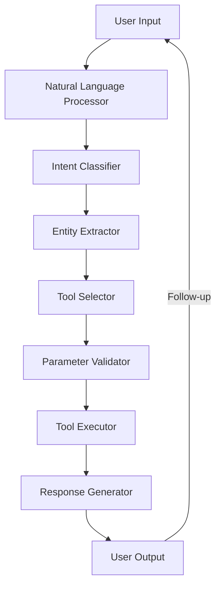

# AI-Powered Natural Language MCP Server

## Table of Contents
1. [Introduction](#introduction)
2. [Core Concepts](#core-concepts)
3. [Architecture](#architecture)
4. [Implementation Guide](#implementation-guide)
5. [Advanced Features](#advanced-features)
6. [Best Practices](#best-practices)
7. [Example Use Cases](#example-use-cases)
8. [Troubleshooting](#troubleshooting)

## Introduction

AI-powered Natural Language MCP servers represent the next evolution in human-computer interaction, enabling users to interact with complex systems using natural language. This document outlines how to build and deploy such a system using the Model Control Protocol (MCP) framework.

## Core Concepts

### 1. Natural Language Understanding (NLU)
- Converts user intents into structured actions
- Handles variations in language and phrasing
- Extracts entities and parameters from text

### 2. Tool Abstraction Layer
- Maps natural language to specific MCP tools
- Handles parameter validation and type conversion
- Manages tool execution context

### 3. Context Management
- Maintains conversation state
- Handles multi-turn interactions
- Manages user preferences and history

## Architecture



## Implementation Guide

### 1. Prerequisites
- Python 3.8+
- FastMCP 2.10+
- LLM API access (e.g., Claude, GPT-4)
- Required Python packages:
  ```bash
  pip install fastmcp python-dotenv openai anthropic
  ```

### 2. Project Structure
```
my_ai_mcp/
├── src/
│   ├── __init__.py
│   ├── main.py          # Entry point
│   ├── nlu/             # Natural Language Understanding
│   ├── tools/           # MCP tool implementations
│   └── utils/           # Helper functions
├── tests/               # Unit and integration tests
├── .env                 # Environment variables
├── requirements.txt     # Dependencies
└── README.md
```

### 3. Basic Implementation

#### 3.1 Main Server Setup
```python
from fastmcp import FastMCP, Tool

app = FastMCP("ai-natural-language-mcp")

@app.tool("execute_natural_language")
async def execute_natural_language(query: str, context: dict = None) -> str:
    """
    Execute a natural language command.
    
    Args:
        query: The natural language command to execute
        context: Optional context from previous interactions
    """
    # Process natural language and execute appropriate tools
    result = await process_natural_language(query, context)
    return result
```

#### 3.2 Natural Language Processing
```python
async def process_natural_language(query: str, context: dict = None) -> str:
    """Process natural language and execute corresponding tools."""
    # 1. Classify intent
    intent = await classify_intent(query)
    
    # 2. Extract entities and parameters
    parameters = await extract_entities(query, intent)
    
    # 3. Map to MCP tools
    tool_name, tool_args = await map_to_tools(intent, parameters)
    
    # 4. Execute the tool
    result = await app.execute_tool(tool_name, **tool_args)
    
    # 5. Generate natural language response
    return await generate_response(result, query)
```

## Advanced Features

### 1. Multi-turn Conversations
```python
class ConversationManager:
    def __init__(self):
        self.conversations = {}
        
    async def handle_message(self, user_id: str, message: str) -> str:
        context = self.conversations.get(user_id, {"history": []})
        
        # Process with conversation history
        response = await process_with_context(message, context)
        
        # Update conversation history
        context["history"].append((message, response))
        self.conversations[user_id] = context
        
        return response
```

### 2. Dynamic Tool Discovery
```python
async def get_available_tools() -> List[dict]:
    """Return list of available tools with descriptions."""
    tools = []
    for name, tool in app.registered_tools.items():
        tools.append({
            "name": name,
            "description": tool.func.__doc__,
            "parameters": get_tool_parameters(tool.func)
        })
    return tools
```

## Best Practices

1. **Tool Design**
   - Keep tools focused and single-purpose
   - Provide clear, detailed docstrings
   - Handle errors gracefully

2. **Performance**
   - Cache common queries
   - Batch similar operations
   - Monitor and optimize response times

3. **Security**
   - Validate all inputs
   - Implement rate limiting
   - Log and monitor tool usage

## Example Use Cases

1. **Data Analysis**
   - "Show me sales trends for Q2 2023"
   - "Compare revenue between product A and B"

2. **System Administration**
   - "Restart the web server"
   - "Check disk usage on the database server"

3. **Content Generation**
   - "Write a blog post about MCP servers"
   - "Generate a report on last month's metrics"

## Troubleshooting

### Common Issues
1. **Misunderstood Commands**
   - Add more training examples
   - Improve error messages
   
2. **Slow Response Times**
   - Optimize tool implementations
   - Implement caching
   - Consider batching requests

3. **Authentication Failures**
   - Verify API keys
   - Check permissions
   - Review rate limits

## Next Steps

1. Implement basic tools
2. Set up the NLU pipeline
3. Add conversation management
4. Deploy and test with real users
5. Iterate based on feedback

## Resources

- [FastMCP Documentation](https://fastmcp.readthedocs.io/)
- [Natural Language Processing Best Practices](https://nlp.stanford.edu/)
- [MCP Protocol Specification](https://mcp-spec.org/)
